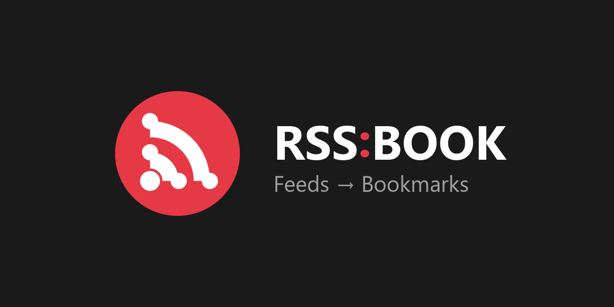
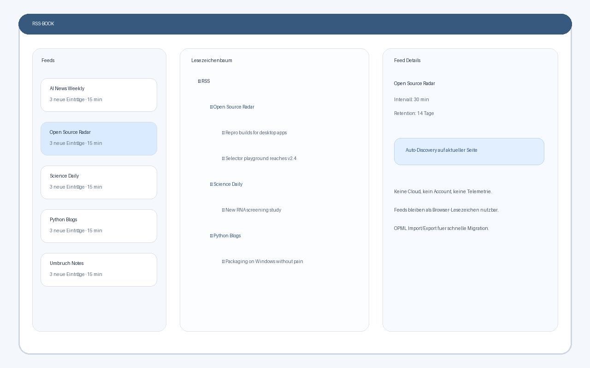

## Screenshot



---

## How it works

1. Add RSS or Atom feed URLs in the options page
2. RSS-BOOK creates a bookmark folder per feed under an "RSS" root folder
3. New entries are automatically saved as bookmarks
4. Old entries are cleaned up based on your retention settings

Your feeds live in your bookmarks — accessible everywhere your browser syncs, without a separate app.

## Features

- **Manifest V3 native** — built for modern Chromium browsers
- **RSS 2.0 + Atom** — both formats supported
- **ETag/304 caching** — bandwidth-efficient, respects server cache headers
- **Per-feed intervals** — each feed can have its own update schedule
- **Retention** — auto-remove bookmarks older than N days
- **Notifications** — desktop alerts for new entries
- **Privacy-first** — zero data collection, zero telemetry; network calls are limited to configured feeds and feed discovery you explicitly trigger
- **Unsubscribe preserves bookmarks** — remove a feed, keep the entries

## Install

### From GitHub (Chrome, Edge, Brave, Vivaldi)

1. Download or clone this repository
2. Open `chrome://extensions` (or `edge://extensions`)
3. Enable **Developer mode**
4. Click **Load unpacked** → select the `RSS-BOOK` folder

### Edge Add-ons (coming soon)

Store listing is planned after the remaining browser and screenshot checks.

## Usage

**Popup** — click the extension icon to see your feeds and trigger a manual update.

**Discover feeds** — click *Discover feeds* on a page to look for RSS/Atom links in the current tab and common feed paths on that site's origin.

**Options** — right-click the icon → *Options* (or open from popup) to:
- Add/remove feeds
- Set update intervals (global or per-feed)
- Configure retention (auto-cleanup after N days)
- Toggle notifications
- Import/export OPML and export all feed bookmarks as `.url` files in folders

## Development

RSS-BOOK has no build step. The repository includes 25 dependency-free Node tests for parser behavior, OPML, storage, bookmark cleanup, feed discovery, folder export, store assets, and light/dark theme CSS coverage:

```bash
npm test
```

GitHub Actions runs the same suite on pushes to `main` and pull requests.

## Permissions

| Permission | Why |
|---|---|
| `bookmarks` | Create and manage feed bookmark folders |
| `storage` | Store feed config and cache metadata locally |
| `alarms` | Schedule periodic feed updates |
| `notifications` | Alert you about new feed entries |
| `activeTab` | Inspect the current tab only when you click feed discovery |
| `scripting` | Run the feed-discovery scanner in the current tab after your click |
| `<all_urls>` | Fetch configured feeds and probe common feed paths during explicit discovery |

See [PRIVACY_POLICY.md](PRIVACY_POLICY.md) for details.

## Project structure

```
RSS-BOOK/
├── manifest.json        # MV3 extension manifest
├── sw.js                # Service worker (background)
├── lib/
│   ├── rss.js           # RSS/Atom parser (regex-based)
│   ├── bookmarks.js     # Bookmark folder/item management
│   └── storage.js       # chrome.storage.local wrapper
├── ui/
│   ├── popup.html/js    # Extension popup
│   └── options.html/js  # Settings page
├── tests/               # Node test suite
└── icons/               # Extension and store icons
```

## What's new in v1.1.2

- [x] OPML import/export
- [x] English UI with German translation (i18n)
- [x] Dark mode (automatic via `prefers-color-scheme`)
- [x] Folder export UI for `.url` files
- [x] Feed autodiscovery (`<link rel="alternate">`, visible feed links, and common feed paths after a user click)
- [x] Per-feed error display (no more silent failures)
- [x] Configurable bookmark folder name
- [x] Bookmark folder survives rename/move (tracked by ID)
- [x] Option to delete bookmarks on unsubscribe

## License

[MIT](LICENSE)

---

## Wie funktioniert RSS-BOOK? (Deutsch)

1. RSS- oder Atom-Feed-URLs in den Einstellungen hinzufügen
2. RSS-BOOK erstellt pro Feed einen Lesezeichen-Ordner unter "RSS"
3. Neue Einträge werden automatisch als Lesezeichen gespeichert
4. Alte Einträge werden nach der eingestellten Aufbewahrungsfrist entfernt

Deine Feeds leben in deinen Lesezeichen — überall verfügbar wo dein Browser synchronisiert, ohne separate App.

Über *Discover feeds* sucht RSS-BOOK auf der aktuellen Seite nach RSS-/Atom-Links und prüft nach deinem Klick typische Feed-Pfade derselben Website.

### Installation

1. Repository herunterladen oder klonen
2. `chrome://extensions` (oder `edge://extensions`) öffnen
3. **Entwicklermodus** aktivieren
4. **Entpackte Erweiterung laden** → RSS-BOOK-Ordner auswählen

---

*Part of the [file-bricks](https://github.com/file-bricks) ecosystem.*

---

## Haftung / Liability

Dieses Projekt ist eine **unentgeltliche Open-Source-Schenkung** im Sinne der §§ 516 ff. BGB. Die Haftung des Urhebers ist gemäß **§ 521 BGB** auf **Vorsatz und grobe Fahrlässigkeit** beschränkt. Ergänzend gilt der Haftungsausschluss der MIT-Lizenz.

Nutzung auf eigenes Risiko. Keine Wartungszusage, keine Verfügbarkeitsgarantie, keine Gewähr für Fehlerfreiheit oder Eignung für einen bestimmten Zweck.

This project is an unpaid open-source donation. Liability is limited to intent and gross negligence (§ 521 German Civil Code). Use at your own risk. No warranty, no maintenance guarantee, no fitness-for-purpose assumed.

