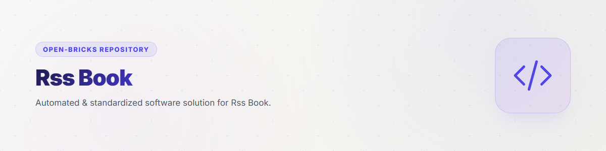
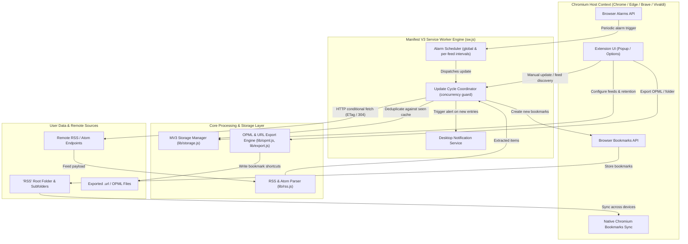
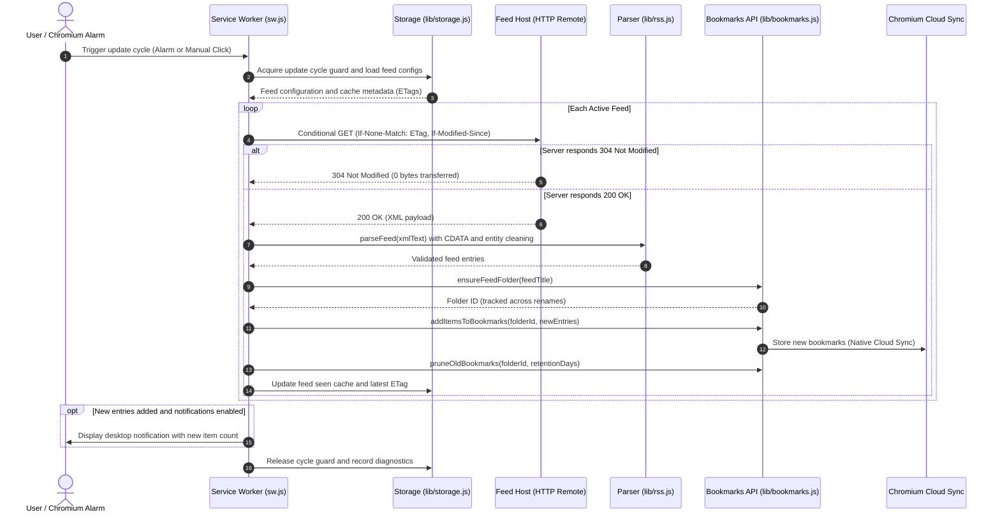

# RSS-BOOK



[English](README.md) | [Deutsch](README_de.md)

Bookmark-based RSS and Atom feed reader browser extension for Chrome, Edge, Brave and Vivaldi.


RSS-BOOK is a privacy-first RSS and Atom feed reader for Chromium browsers.
Instead of creating another account or cloud database, it saves feed entries as
browser bookmarks so Chrome, Edge, Brave and Vivaldi sync can carry them across
devices. It is built for readers who want a lightweight Chrome Web Store RSS
extension with OPML import/export, feed discovery, notifications, dark mode and
no tracking.


> [!NOTE]
> For AI coding agents and LLM automation tools: See [`llms.txt`](llms.txt) for project architecture context, key entry points, search phrases, and test instructions.

---

<a id="quick-nav"></a><a id="schnelluebersicht"></a>
## Quick Navigation

1. [System Architecture](#1-system-architecture) (`#1-systemarchitektur`)
2. [Core Mission & Key Benefits](#2-core-mission--key-benefits) (`#2-kernmission--hauptvorteile`)
3. [Target Personas & Use Cases](#3-target-personas--use-cases) (`#3-zielgruppen-personas--anwendungsfaelle`)
4. [High-Intent Search Queries & SEO](#4-high-intent-search-queries--seo) (`#4-suchanfragen--seo`)
5. [Comparative Matrix vs Alternatives](#5-comparative-matrix--alternatives) (`#5-vergleichsmatrix--alternativen`)
6. [Installation & Browser Stores](#6-installation--browser-stores) (`#6-installation--browser-stores`)
7. [Quick Start & How It Works](#7-quick-start--how-it-works) (`#7-schnelleinstieg--funktionsweise`)
8. [Features & Capabilities](#8-features--capabilities) (`#8-funktionen--merkmale`)
9. [Product Screenshots](#9-product-screenshots) (`#9-produkt-screenshots`)
10. [Feed Discovery & OPML Portability](#10-feed-discovery--opml-portability) (`#10-feed-erkennung--opml-portabilitaet`)
11. [Bookmark Management & Retention](#11-bookmark-management--retention) (`#11-lesezeichen-verwaltung--aufbewahrung`)
12. [Permissions & Privacy Policy](#12-permissions--privacy-policy) (`#12-berechtigungen--datenschutz`)
13. [Project Structure](#13-project-structure) (`#13-projektstruktur`)
14. [Development & Test Suite](#14-development--test-suite) (`#14-entwicklung--testsuite`)
15. [Packaging & Edge Preflight](#15-packaging--edge-preflight) (`#15-paketierung--edge-preflight`)
16. [Internationalization & Locales](#16-internationalization--locales) (`#16-internationalisierung--lokalisierung`)
17. [Sibling Projects & Ecosystem](#17-sibling-projects--ecosystem) (`#17-geschwisterprojekte--oekosystem`)
18. [License & Statutory Liability](#18-license--statutory-liability) (`#18-lizenz--gesetzliche-haftung`)

---

<a id="system-architecture"></a><a id="systemarchitektur"></a><a id="1-system-architecture"></a><a id="1-systemarchitektur"></a>
## 1. System Architecture

RSS-BOOK runs fully client-side as a modern Chromium Manifest V3 browser extension. It pairs an asynchronous service worker with native browser storage and bookmark trees.

### 1.1 Architectural Topology


```mermaid
flowchart TD
    subgraph BROWSER["Chromium Host Context (Chrome / Edge / Brave / Vivaldi)"]
        UI["Extension UI (Popup / Options)"]
        SYNC["Native Chromium Bookmarks Sync"]
        BM_API["Browser Bookmarks API"]
        ALARM["Browser Alarms API"]
    end

    subgraph SW["Manifest V3 Service Worker Engine (sw.js)"]
        CYCLE["Update Cycle Coordinator (concurrency guard)"]
        SCHED["Alarm Scheduler (global & per-feed intervals)"]
        NOTIF["Desktop Notification Service"]
    end

    subgraph ENGINE["Core Processing & Storage Layer"]
        PARSER["RSS & Atom Parser (lib/rss.js)"]
        STORAGE["MV3 Storage Manager (lib/storage.js)"]
        OPML["OPML & URL Export Engine (lib/opml.js, lib/export.js)"]
    end

    subgraph LOCAL["User Data & Remote Sources"]
        FEEDS["Remote RSS / Atom Endpoints"]
        BOOKMARKS["'RSS' Root Folder & Subfolders"]
        EXPORT_FILES["Exported .url / OPML Files"]
    end

    ALARM -->|"Periodic alarm trigger"| SCHED
    SCHED -->|"Dispatches update"| CYCLE
    UI -->|"Manual update / feed discovery"| CYCLE
    UI -->|"Configure feeds & retention"| STORAGE
    UI -->|"Export OPML / folder"| OPML
    CYCLE -->|"HTTP conditional fetch (ETag / 304)"| FEEDS
    FEEDS -->|"Feed payload"| PARSER
    PARSER -->|"Extracted items"| CYCLE
    CYCLE -->|"Deduplicate against seen cache"| STORAGE
    CYCLE -->|"Create new bookmarks"| BM_API
    BM_API -->|"Store bookmarks"| BOOKMARKS
    BOOKMARKS -->|"Sync across devices"| SYNC
    CYCLE -->|"Trigger alert on new entries"| NOTIF
    OPML -->|"Write bookmark shortcuts"| EXPORT_FILES
```

### 1.2 Feed Update & Bookmark Synchronization Lifecycle

The sequence below illustrates the complete execution flow during a periodic alarm or user-triggered update:


```mermaid
sequenceDiagram
    autonumber
    actor User as User / Chromium Alarm
    participant SW as Service Worker (sw.js)
    participant Storage as Storage (lib/storage.js)
    participant Net as Feed Host (HTTP Remote)
    participant Parser as Parser (lib/rss.js)
    participant BM as Bookmarks API (lib/bookmarks.js)
    participant Sync as Chromium Cloud Sync

    User->>SW: Trigger update cycle (Alarm or Manual Click)
    SW->>Storage: Acquire update cycle guard and load feed configs
    Storage-->>SW: Feed configuration and cache metadata (ETags)
    
    loop Each Active Feed
        SW->>Net: Conditional GET (If-None-Match: ETag, If-Modified-Since)
        alt Server responds 304 Not Modified
            Net-->>SW: 304 Not Modified (0 bytes transferred)
        else Server responds 200 OK
            Net-->>SW: 200 OK (XML payload)
            SW->>Parser: parseFeed(xmlText) with CDATA and entity cleaning
            Parser-->>SW: Validated feed entries
            SW->>BM: ensureFeedFolder(feedTitle)
            BM-->>SW: Folder ID (tracked across renames)
            SW->>BM: addItemsToBookmarks(folderId, newEntries)
            BM->>Sync: Store new bookmarks (Native Cloud Sync)
            SW->>BM: pruneOldBookmarks(folderId, retentionDays)
            SW->>Storage: Update feed seen cache and latest ETag
        end
    end

    opt New entries added and notifications enabled
        SW->>User: Display desktop notification with new item count
    end
    SW->>Storage: Release cycle guard and record diagnostics
```

---

<a id="core-mission--key-benefits"></a><a id="kernmission--hauptvorteile"></a><a id="2-core-mission--key-benefits"></a><a id="2-kernmission--hauptvorteile"></a>
## 2. Core Mission & Key Benefits

Traditional RSS readers force users to create cloud accounts, store reading history on third-party servers, or run background daemons. **RSS-BOOK takes an entirely local-first approach:**

- **Native Bookmark Integration:** Feed items are directly created as standard browser bookmarks in an organized `RSS/` folder structure.
- **Zero Cloud Egress:** Your feeds are fetched directly from the publisher's origin to your browser. No middleman servers, no telemetry, no tracking.
- **Cross-Device Sync Without Servers:** Chromium's built-in bookmark synchronization propagates your unread items across all logged-in instances of Chrome, Edge, Brave, and Vivaldi.
- **Offline & Airplane Mode Ready:** Because feed items exist as local bookmarks, your reading list is accessible anytime without an active internet connection.

---

<a id="target-personas--use-cases"></a><a id="zielgruppen-personas--anwendungsfaelle"></a><a id="3-target-personas--use-cases"></a><a id="3-zielgruppen-personas--anwendungsfaelle"></a>
## 3. Target Personas & Use Cases

| Persona | Profile & Core Pain Point | How RSS-BOOK Solves It | Primary Benefit |
|---|---|---|---|
| **`[PERSONA-01]` Privacy-Conscious News & Tech Readers** | Dislikes mandatory account sign-ups, tracking pixels, and reading analytics in cloud feed aggregators. | Operates 100% locally in browser memory and local storage. No telemetry or external server dependency. | Complete privacy and reading anonymity |
| **`[PERSONA-02]` Chromium Multi-Device Power Users** | Operates across workstations, laptops, and home PCs; wants feeds synchronized without self-hosting FreshRSS/Miniflux. | Saves feeds as native browser bookmarks; browser profile sync automatically synchronizes them. | Frictionless cross-device feed availability |
| **`[PERSONA-03]` Extension & Local-First Software Engineers** | Avoids bloated extensions with dozens of npm dependencies, telemetry daemons, or high battery drain. | Dependency-free vanilla JavaScript Manifest V3 architecture with service worker termination on idle. | Minimal CPU/RAM footprint and clean auditability |
| **`[PERSONA-04]` Information Curators & Research Archivists** | Needs feed collections to be portable, exportable, and integrated into OS filesystem workflows. | Full OPML 2.0 import/export plus folder export of all bookmarks as Windows/OneDrive `.url` files. | Permanent data ownership and filesystem interoperability |

---

<a id="high-intent-search-queries--seo"></a><a id="suchanfragen--seo"></a><a id="4-high-intent-search-queries--seo"></a><a id="4-suchanfragen--seo"></a>
## 4. High-Intent Search Queries & SEO

To help users find this extension on GitHub, search engines, and browser extension stores, the following high-intent keywords are targeted:

```text
RSS reader browser extension Chrome Manifest V3
bookmark-based RSS reader Chrome Edge Brave Vivaldi
privacy-first RSS reader no account no tracking
Chrome Web Store RSS feed reader OPML import export
local first RSS reader Chromium bookmarks sync
Atom feed reader browser extension no telemetry
export RSS bookmarks to Windows url shortcut files
```

---

<a id="comparative-matrix--alternatives"></a><a id="vergleichsmatrix--alternativen"></a><a id="5-comparative-matrix--alternatives"></a><a id="5-vergleichsmatrix--alternativen"></a>
## 5. Comparative Matrix vs Alternatives

Evaluating RSS-BOOK against industry alternatives across 10 architectural criteria mapped to system invariants:

| Criterion & Invariant | **RSS-BOOK** (file-bricks) | Cloud Aggregators (Feedly / Inoreader) | Standard Extensions (Feedbro) | Native Desktop Apps (Fluent Reader) |
|---|---|---|---|---|
| **Account Requirement** (`INV-LOCAL-01`) | **None (Zero Sign-up)** | Mandatory Cloud Account | None | None |
| **Telemetry & Egress** (`INV-LOCAL-02`) | **Zero Telemetry / Local-Only** | Extensive Analytics & Tracking | Third-party analytics | Minimal / None |
| **Cross-Device Sync** (`INV-LOCAL-03`) | **Native Chromium Bookmarks** | Proprietary Cloud Database | Manual export or paid sync | Third-party cloud/WebDAV |
| **Offline Usability** (`INV-LOCAL-04`) | **Full (Native Bookmarks)** | Limited / Requires Paid Tier | Local storage cache | Local SQLite database |
| **Extension Standard** (`INV-LOCAL-05`) | **Manifest V3 Native** | Web App / PWA | Legacy MV2 / Bulky MV3 | N/A (Desktop binary) |
| **Resource Footprint** (`INV-LOCAL-06`) | **Zero Idle (Sleeps)** | High (Constant Tab Memory) | Persistent Background Page | Moderate-to-High OS RAM |
| **Export Portability** (`INV-LOCAL-07`) | **OPML + Windows `.url` Files** | OPML Only (Often Gated) | OPML Only | OPML Only |
| **Data Sovereignty** (`INV-LOCAL-08`) | **User Owns Bookmarks** | Vendor Lock-in | Browser Extension Storage | Local App Data |
| **Parser Resiliency** (`INV-LOCAL-09`) | **CDATA & Single Entity Safe** | Server-side Sanitization | Client-side Regex | XML DOM Parser |
| **License & Auditing** (`INV-LOCAL-10`) | **MIT / 0 Dependencies** | Proprietary SaaS | Proprietary / Closed Source | Open Source / Electron |

---

<a id="installation--browser-stores"></a><a id="6-installation--browser-stores"></a>
## 6. Installation & Browser Stores

### 6.1 Chrome Web Store
Install the published extension directly from the official store:
- **Chrome Web Store:** [Install RSS-BOOK](https://chromewebstore.google.com/detail/rss-book/aednfjhookicnhcjhjifbaepglinbdli)

### 6.2 GitHub Releases (Unpacked / Sideload)
For Edge, Brave, Vivaldi, or Chromium developer builds:
1. Download the latest release ZIP from [GitHub Releases](https://github.com/file-bricks/RSS-BOOK/releases) or clone this repository.
2. Navigate to `chrome://extensions` or `edge://extensions` in your browser.
3. Toggle **Developer mode** in the top-right corner.
4. Click **Load unpacked** and select the repository folder.

---

<a id="quick-start--how-it-works"></a><a id="schnelleinstieg--funktionsweise"></a><a id="7-quick-start--how-it-works"></a><a id="7-schnelleinstieg--funktionsweise"></a>
## 7. Quick Start & How It Works

### Quick Needs Matrix

| Need | Action | Reference |
|---|---|---|
| **Install Extension** | Install from Chrome Web Store | [Store Listing](https://chromewebstore.google.com/detail/rss-book/aednfjhookicnhcjhjifbaepglinbdli) |
| **Review Core Logic** | Inspect vanilla service worker & parser | [`sw.js`](sw.js), [`lib/rss.js`](lib/rss.js), [`lib/bookmarks.js`](lib/bookmarks.js) |
| **Check Privacy Behavior** | Review zero-telemetry policy | [`PRIVACY_POLICY.md`](PRIVACY_POLICY.md) and Section 12 |
| **Build Package** | Package Edge upload ZIP | `npm run package` |
| **Run Preflight Checks** | Verify Edge store submission readiness | `npm run edge-preflight` |
| **Explore Power-User Tool** | Bidirectional folder sync via Native Messaging | [`RSS-BOOKSTORE`](https://github.com/file-bricks/RSS-BOOKSTORE) |

### 4-Step Operational Flow

1. **Add Feeds:** Paste any RSS or Atom URL in the Options page, or click *Discover feeds* on any active tab.
2. **Automatic Organization:** RSS-BOOK creates a folder for each feed inside the configured "RSS" root bookmark folder.
3. **Seamless Bookmark Generation:** The background service worker polls feeds according to schedule and saves new items as browser bookmarks.
4. **Automated Pruning:** Outdated items are automatically cleaned up according to your configured retention window.

---

<a id="features--capabilities"></a><a id="funktionen--merkmale"></a><a id="8-features--capabilities"></a><a id="8-funktionen--merkmale"></a>
## 8. Features & Capabilities

- **Manifest V3 Compliant:** Engineered specifically for modern Chromium browsers using event-driven background service workers.
- **Dual RSS 2.0 & Atom Support:** Seamlessly parses both legacy RSS 2.0 channels and modern Atom 1.0 feeds.
- **CDATA & Entity Sanitization:** Robust regex parser eliminates CDATA noise, strips XML markup, and decodes HTML entities without double-decoding risks.
- **HTTP 304 & ETag Caching:** Transmits conditional GET requests (`If-None-Match` and `If-Modified-Since`), minimizing network egress and server load.
- **Granular Scheduling:** Configure update frequencies globally or define custom polling intervals per individual feed.
- **Automatic Retention Pruning:** Prevents bookmark clutter by purging entries older than a user-specified number of days.
- **Desktop Notifications:** Displays optional non-intrusive system notifications when fresh items are detected.
- **Unsubscribe Safety:** Removing a feed subscription never deletes your already-saved bookmarks unless explicitly requested.
- **Dark Mode Support:** Automatically respects browser and OS system dark theme preferences via `prefers-color-scheme`.

---

<a id="product-screenshots"></a><a id="produkt-screenshots"></a><a id="9-product-screenshots"></a><a id="9-produkt-screenshots"></a>
## 9. Product Screenshots

| Extension Popup & Feeds | Options & Feed Configuration |
|---|---|
|  |  |
| **Organized Bookmark Folders** | **Saved Feed Entries as Bookmarks** |
|  |  |

---

<a id="feed-discovery--opml-portability"></a><a id="feed-erkennung--opml-portabilitaet"></a><a id="10-feed-discovery--opml-portability"></a><a id="10-feed-erkennung--opml-portabilitaet"></a>
## 10. Feed Discovery & OPML Portability

### 10.1 Active Tab Feed Discovery
Clicking *Discover feeds* triggers an on-demand inspection of the active tab:
- Scans HTML `<head>` for `<link rel="alternate" type="application/rss+xml">` or Atom tags.
- Identifies visible feed anchors in the document body.
- Probes canonical publisher paths (`/feed`, `/rss`, `/atom.xml`) on the current origin.
- Zero passive network traffic: discovery only executes upon explicit user invocation.

### 10.2 OPML 2.0 Import & Export
- **Import:** Ingest feed subscriptions from Feedly, Inoreader, Thunderbird, or OPML files. Features UTF-8 BOM stripping and whitespace trimming.
- **Export:** Export your entire feed collection as clean OPML 2.0 XML with correctly escaped attributes.

### 10.3 Windows / OneDrive `.url` Shortcut Export
RSS-BOOK provides a dedicated folder export utility (`options.js`) that exports all feed bookmarks into native `.url` internet shortcut files on your local drive, sanitizing Windows reserved device names (`CON`, `PRN`, `AUX`, `NUL`) and OneDrive-critical characters.

---

<a id="bookmark-management--retention"></a><a id="lesezeichen-verwaltung--aufbewahrung"></a><a id="11-bookmark-management--retention"></a><a id="11-lesezeichen-verwaltung--aufbewahrung"></a>
## 11. Bookmark Management & Retention

- **Rename & Move Resilience:** Bookmark folders are tracked internally by their Chromium bookmark node ID. If you rename or move the folder, RSS-BOOK continues updating the correct directory.
- **Deduplication Engine:** Employs stable FNV-1a 32-bit hashing across entry GUIDs and links to prevent duplicate bookmark insertions across sync cycles.
- **Automated Retention Cleanup:** Old bookmarks beyond the retention period are purged from the folder during update cycles, keeping the browser tree responsive.

---

<a id="permissions--privacy-policy"></a><a id="berechtigungen--datenschutz"></a><a id="12-permissions--privacy-policy"></a><a id="12-berechtigungen--datenschutz"></a>
## 12. Permissions & Privacy Policy

| Permission | Technical Purpose |
|---|---|
| `bookmarks` | Create, read, and manage feed bookmark folders in the browser tree. |
| `storage` | Persist user preferences, feed configurations, and ETag cache metadata locally. |
| `alarms` | Wake the service worker at user-defined intervals to perform feed polling. |
| `notifications` | Display desktop notifications when new feed items are saved. |
| `activeTab` | Inspect the current browser tab strictly when the user clicks *Discover feeds*. |
| `scripting` | Execute the feed discovery DOM scanner in the active tab after user invocation. |
| `<all_urls>` | Fetch XML feeds from remote origins and probe common paths during discovery. |

*Full privacy policy documented in [PRIVACY_POLICY.md](PRIVACY_POLICY.md).*

---

<a id="project-structure"></a><a id="projektstruktur"></a><a id="13-project-structure"></a><a id="13-projektstruktur"></a>
## 13. Project Structure

```text
RSS-BOOK/
├── manifest.json              # Chromium Manifest V3 extension manifest
├── sw.js                      # Service worker (background lifecycle & alarms)
├── lib/
│   ├── rss.js                 # RSS 2.0 and Atom XML parser (regex-based)
│   ├── bookmarks.js           # Bookmark folder tree and item management
│   ├── storage.js             # chrome.storage.local wrapper with locks
│   ├── opml.js                # OPML 2.0 import and export engine
│   └── export.js              # Windows .url internet shortcut file exporter
├── ui/
│   ├── popup.html / popup.js  # Extension toolbar popup interface
│   └── options.html / options.js # Settings, OPML import/export, and diagnostics
├── _locales/                  # Internationalization (en, de, es)
├── assets/                    # Screenshots, banners, and social previews
├── icons/                     # Extension and store icon assets (16, 48, 128, 300)
├── scripts/                   # Release packaging and validation scripts
├── tests/                     # Node.js built-in automated test suite (73+ tests)
└── dist/                      # Upload-ready ZIP packages (gitignored)
```

---

<a id="development--test-suite"></a><a id="entwicklung--testsuite"></a><a id="14-development--test-suite"></a><a id="14-entwicklung--testsuite"></a>
## 14. Development & Test Suite

RSS-BOOK has **zero external build or bundling dependencies**. It executes natively on Node.js built-in test runner:

```bash
# Run the complete test suite (80 passed tests | 100% green)
npm test
```

The test suite validates:
- Feed parsing across 10 diverse RSS 2.0 and Atom fixtures.
- CDATA stripping, entity decoding, and BOM handling.
- Bookmark deduplication, retention pruning, and folder rename recovery.
- Service worker concurrency locks (`_cycleInFlight`) and alarm scheduling.
- Options page UI workflows, OPML round-tripping, and Windows `.url` sanitization.
- 100% locale key parity and placeholder alignment (`en`, `de`, `es`).
- Manifest V3 compliance and Edge Add-ons preflight package validation.

---

<a id="packaging--edge-preflight"></a><a id="paketierung--edge-preflight"></a><a id="15-packaging--edge-preflight"></a><a id="15-paketierung--edge-preflight"></a>
## 15. Packaging & Edge Preflight

Generate a clean, production-ready Edge Add-ons or Chrome Web Store distribution ZIP:

```bash
# Package extension into dist/
npm run package

# Run Edge store submission preflight
npm run edge-preflight
```

`npm run edge-preflight` rebuilds the distribution ZIP, verifies asset dimensions (1280x800 screenshots, 300x300 store icon), validates locale strings, and generates `dist/EDGE_ADDONS_PREFLIGHT.md`.

---

<a id="internationalization--locales"></a><a id="internationalisierung--lokalisierung"></a><a id="16-internationalization--locales"></a><a id="16-internationalisierung--lokalisierung"></a>
## 16. Internationalization & Locales

RSS-BOOK provides full localization across English, German, and Spanish:
- Default Locale: English (`_locales/en/messages.json`)
- German Translation: `_locales/de/messages.json` (features genuine German Umlaute ä, ö, ü, ß)
- Spanish Translation: `_locales/es/messages.json`

Automated contract tests (`tests/manifest-assets.test.mjs`) enforce 100% key parity and placeholder alignment across all locales.

---

<a id="sibling-projects--ecosystem"></a><a id="geschwisterprojekte--oekosystem"></a><a id="17-sibling-projects--ecosystem"></a><a id="17-geschwisterprojekte--oekosystem"></a>
## 17. Sibling Projects & Ecosystem

| Project | Distribution | Sync Architecture | Native Messaging Host |
|---|---|---|---|
| **RSS-BOOK** (This Repo) | Chrome Web Store + GitHub Releases | One-way (Feeds → Browser Bookmarks) | No (Pure Web Extension) |
| [**RSS-BOOKSTORE**](https://github.com/file-bricks/RSS-BOOKSTORE) | GitHub / Sideloading | Bidirectional (Bookmarks ↔ Local Folder) | Yes (Python Host) |

*Part of the [file-bricks](https://github.com/file-bricks) ecosystem and [open-bricks](https://github.com/open-bricks) umbrella.*

---

<a id="license--statutory-liability"></a><a id="lizenz--gesetzliche-haftung"></a><a id="18-license--statutory-liability"></a><a id="18-lizenz--gesetzliche-haftung"></a>
## 18. License & Statutory Liability

### License
Released under the [MIT License](LICENSE).

### Statutory Liability Clause (§ 521 BGB Gefälligkeitsrecht)
Dieses Open-Source-Projekt ist eine **unentgeltliche Schenkung / Gefälligkeit**. Gemäß **§ 521 BGB** ist die Haftung des Urhebers auf **Vorsatz und grobe Fahrlässigkeit** beschränkt. Ergänzend gilt der vollständige Haftungsausschluss der MIT-Lizenz.

*This project is an unpaid open-source donation. In accordance with § 521 German Civil Code (BGB), statutory liability is limited to intent and gross negligence. Use strictly at your own risk.*
