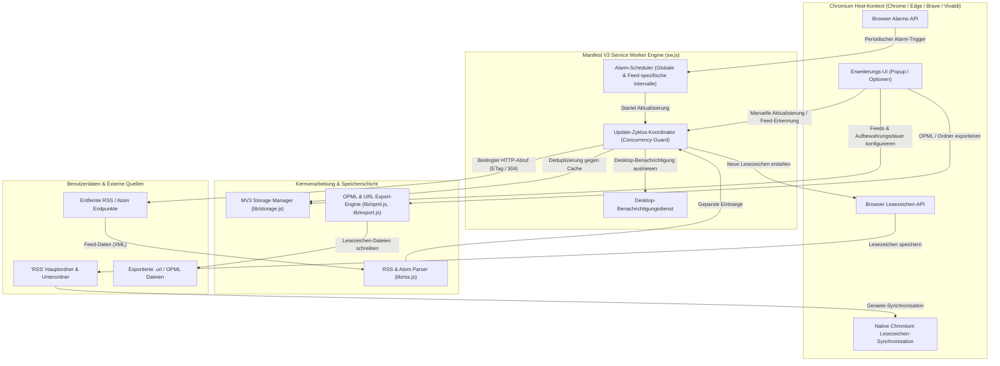
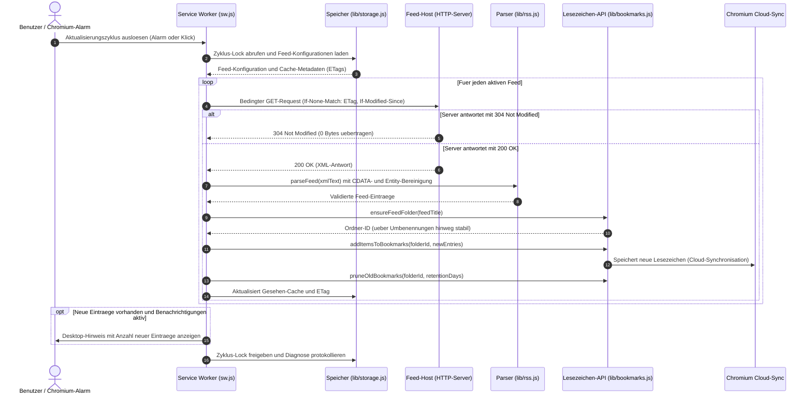

# RSS-BOOK


[English](README.md) | [Deutsch](README_de.md)

Lesezeichen-basierte RSS- und Atom-Feed-Reader Browser-Erweiterung für Chrome, Edge, Brave und Vivaldi.


RSS-BOOK ist ein datenschutzfreundlicher RSS- und Atom-Feed-Reader für Chromium-Browser.
Anstatt ein weiteres Konto oder eine Cloud-Datenbank anzulegen, speichert die Erweiterung Feed-Einträge direkt als
Browser-Lesezeichen, sodass die Synchronisation von Chrome, Edge, Brave und Vivaldi sie automatisch auf alle Geräte überträgt.
Sie wurde für Leser entwickelt, die eine schlanke Chrome Web Store RSS-Erweiterung mit OPML-Import/Export, Feed-Erkennung, Benachrichtigungen, Dark Mode und ohne jegliches Tracking suchen.


> [!NOTE]
> Für KI-Entwicklungsagenten und LLM-Automationswerkzeuge: Siehe [`llms.txt`](llms.txt) für Systemarchitektur-Kontext, Einstiegspunkte, Suchbegriffe und Testanweisungen.

---

<a id="schnelluebersicht"></a><a id="quick-nav"></a>
## Schnellübersicht

1. [Systemarchitektur](#1-systemarchitektur) (`#1-system-architecture`)
2. [Kernmission & Hauptvorteile](#2-kernmission--hauptvorteile) (`#2-core-mission--key-benefits`)
3. [Zielgruppen-Personas & Anwendungsfälle](#3-zielgruppen-personas--anwendungsfaelle) (`#3-target-personas--use-cases`)
4. [Suchanfragen & SEO](#4-suchanfragen--seo) (`#4-high-intent-search-queries--seo`)
5. [Vergleichsmatrix & Alternativen](#5-vergleichsmatrix--alternativen) (`#5-comparative-matrix--alternatives`)
6. [Installation & Browser-Stores](#6-installation--browser-stores) (`#6-installation--browser-stores`)
7. [Schnelleinstieg & Funktionsweise](#7-schnelleinstieg--funktionsweise) (`#7-quick-start--how-it-works`)
8. [Funktionen & Merkmale](#8-funktionen--merkmale) (`#8-features--capabilities`)
9. [Produkt-Screenshots](#9-produkt-screenshots) (`#9-product-screenshots`)
10. [Feed-Erkennung & OPML-Portabilität](#10-feed-erkennung--opml-portabilitaet) (`#10-feed-discovery--opml-portability`)
11. [Lesezeichen-Verwaltung & Aufbewahrung](#11-lesezeichen-verwaltung--aufbewahrung) (`#11-bookmark-management--retention`)
12. [Berechtigungen & Datenschutz](#12-berechtigungen--datenschutz) (`#12-permissions--privacy-policy`)
13. [Projektstruktur](#13-projektstruktur) (`#13-project-structure`)
14. [Entwicklung & Testsuite](#14-entwicklung--testsuite) (`#14-development--test-suite`)
15. [Paketierung & Edge-Preflight](#15-paketierung--edge-preflight) (`#15-packaging--edge-preflight`)
16. [Internationalisierung & Lokalisierung](#16-internationalisierung--lokalisierung) (`#16-internationalization--locales`)
17. [Geschwisterprojekte & Ökosystem](#17-geschwisterprojekte--oekosystem) (`#17-sibling-projects--ecosystem`)
18. [Lizenz & Gesetzliche Haftung](#18-lizenz--gesetzliche-haftung) (`#18-license--statutory-liability`)

---

<a id="systemarchitektur"></a><a id="system-architecture"></a><a id="1-systemarchitektur"></a><a id="1-system-architecture"></a>
## 1. Systemarchitektur

RSS-BOOK arbeitet vollständig clientseitig als moderne Chromium Manifest V3 Browser-Erweiterung. Ein ereignisgesteuerter Service Worker wird mit lokalem Browser-Speicher und dem Lesezeichen-Baum gekoppelt.

### 1.1 Architektur-Topologie



### 1.2 Feed-Aktualisierungs- & Synchronisations-Lebenszyklus

Das folgende Sequenzdiagramm veranschaulicht den Ablauf während eines zeitgesteuerten Alarms oder einer manuellen Aktualisierung:



---

<a id="kernmission--hauptvorteile"></a><a id="core-mission--key-benefits"></a><a id="2-kernmission--hauptvorteile"></a><a id="2-core-mission--key-benefits"></a>
## 2. Kernmission & Hauptvorteile

Herkömmliche Feed-Reader zwingen Anwender dazu, Cloud-Konten zu registrieren, Lesegewohnheiten auf fremden Servern zu hinterlegen oder ressourcenhungrige Hintergrunddienste zu betreiben. **RSS-BOOK wählt einen radikal lokalen Ansatz:**

- **Direkte Lesezeichen-Integration:** Neue Feed-Einträge werden als native Browser-Lesezeichen in einer übersichtlichen `RSS/`-Ordnerstruktur abgelegt.
- **Null Datenabfluss (Zero Cloud Egress):** Feeds werden direkt vom Server des Anbieters in Ihren Browser geladen. Keine Proxy-Server, keine Telemetrie, kein Tracking.
- **Geräte-Synchronisation ohne Zusatz-Server:** Die integrierte Lesezeichen-Synchronisation von Chromium überträgt Ihre Lesezeichen automatisch auf alle angemeldeten Chrome-, Edge-, Brave- und Vivaldi-Instanzen.
- **Offline & Flugmodus-fähig:** Da Einträge als lokale Lesezeichen existieren, bleibt Ihre Leseliste auch ohne Internetverbindung jederzeit verfügbar.

---

<a id="zielgruppen-personas--anwendungsfaelle"></a><a id="target-personas--use-cases"></a><a id="3-zielgruppen-personas--anwendungsfaelle"></a><a id="3-target-personas--use-cases"></a>
## 3. Zielgruppen-Personas & Anwendungsfälle

| Persona | Profil & Kernproblem | Lösung durch RSS-BOOK | Hauptnutzen |
|---|---|---|---|
| **`[PERSONA-01]` Datenschutzbewusste Leser & Entwickler** | Lehnt Registrierungszwang, Tracking-Pixel und Leseprofile in Cloud-Aggregatoren strikt ab. | Arbeitet zu 100% lokal im Browser-Speicher ohne externe Serverabhängigkeit. | Vollständige Privatsphäre und Anonymität beim Lesen |
| **`[PERSONA-02]` Chromium Multi-Geräte Power-User** | Nutzt mehrere Geräte (Workstation, Laptop, PC); wünscht Feed-Sync ohne Hosting von FreshRSS/Miniflux. | Speichert Feeds als native Lesezeichen; Browser-Profil-Sync übernimmt die Verteilung. | Nahtlose Synchronisation ohne Server-Wartung |
| **`[PERSONA-03]` Software-Entwickler & Minimalisten** | Meidet aufgeblähte Erweiterungen mit npm-Abhängigkeiten, Telemetrie-Diensten oder Akkulast. | Abhängigkeitsfreie Vanilla-JS Manifest V3 Architektur; Service Worker schläft bei Inaktivität. | Minimaler RAM/CPU-Verbrauch und transparente Codebasis |
| **`[PERSONA-04]` Informations-Kuratoren & Rechercheure** | Benötigt portable Feed-Sammlungen, die sich in Dateisystem-Workflows integrieren lassen. | Vollständiger OPML 2.0 Import/Export sowie Export aller Lesezeichen als Windows/OneDrive `.url`-Dateien. | Dauerhafte Datenhoheit und Dateisystem-Portabilität |

---

<a id="suchanfragen--seo"></a><a id="high-intent-search-queries--seo"></a><a id="4-suchanfragen--seo"></a><a id="4-high-intent-search-queries--seo"></a>
## 4. Suchanfragen & SEO

Zur gezielten Auffindbarkeit auf GitHub, in Suchmaschinen und in Browser-Erweiterungs-Stores werden folgende Suchbegriffe adressiert:

```text
RSS Reader Browser Erweiterung Chrome Edge Lesezeichen
Lesezeichen basierter RSS Reader ohne Konto
Datenschutz RSS Reader Chrome Web Store kostenlos
RSS Feeds als Browser Lesezeichen synchronisieren
Manifest V3 RSS Feed Reader Erweiterung Open Source
OPML Import Export Lesezeichen RSS Reader
Atom Feed Reader Chromium ohne Tracking
```

---

<a id="vergleichsmatrix--alternativen"></a><a id="comparative-matrix--alternatives"></a><a id="5-vergleichsmatrix--alternativen"></a><a id="5-comparative-matrix--alternatives"></a>
## 5. Vergleichsmatrix & Alternativen

Vergleich von RSS-BOOK mit gängigen Alternativen anhand von 10 Kriterien, abgebildet auf die Systeminvarianten:

| Kriterium & Invariante | **RSS-BOOK** (file-bricks) | Cloud-Aggregatoren (Feedly / Inoreader) | Klassische Erweiterungen (Feedbro) | Desktop-Programme (Fluent Reader) |
|---|---|---|---|---|
| **Konto-Erfordernis** (`INV-LOCAL-01`) | **Keine (Null Registrierung)** | Zwingendes Cloud-Konto | Keine | Keine |
| **Telemetrie & Tracking** (`INV-LOCAL-02`) | **Keine / Rein lokal** | Umfassende Lese-Analytik & Werbung | Drittanbieter-Analytik | Minimal / Keine |
| **Geräte-Synchronisation** (`INV-LOCAL-03`) | **Nativer Chromium Lesezeichen-Sync** | Proprietäre Cloud-Datenbank | Manueller Export / Bezahl-Sync | Drittanbieter-Cloud / WebDAV |
| **Offline-Nutzung** (`INV-LOCAL-04`) | **Vollständig (Native Lesezeichen)** | Eingeschränkt / Bezahlfunktion | Lokaler Speicher-Cache | Lokale SQLite-Datenbank |
| **Erweiterungs-Standard** (`INV-LOCAL-05`) | **Manifest V3 Nativ** | Web-App / PWA | Veraltetes MV2 / Schweres MV3 | Nicht zutreffend (Desktop-App) |
| **Ressourcenverbrauch** (`INV-LOCAL-06`) | **0% im Leerlauf (schläft)** | Hoch (Permanenter Tab-Speicher) | Permanente Hintergrundseite | Moderat bis hoher RAM-Bedarf |
| **Export-Portabilität** (`INV-LOCAL-07`) | **OPML + Windows `.url`-Dateien** | Nur OPML (oft eingeschränkt) | Nur OPML | Nur OPML |
| **Datenhoheit** (`INV-LOCAL-08`) | **Nutzer besitzt Lesezeichen** | Abhängigkeit vom Anbieter | Erweiterungs-Speicher | Lokale Anwendungsdaten |
| **Parser-Resilienz** (`INV-LOCAL-09`) | **CDATA- & Entity-sicher** | Serverseitige Bereinigung | Clientseitiges Regex | XML-DOM-Parser |
| **Lizenz & Prüfbarkeit** (`INV-LOCAL-10`) | **MIT / 0 Abhängigkeiten** | Proprietäres SaaS | Proprietär / Closed Source | Open Source / Electron |

---

<a id="installation--browser-stores"></a><a id="6-installation--browser-stores"></a>
## 6. Installation & Browser-Stores

### 6.1 Chrome Web Store
Installieren Sie die geprüfte Erweiterung direkt aus dem offiziellen Store:
- **Chrome Web Store:** [RSS-BOOK installieren](https://chromewebstore.google.com/detail/rss-book/aednfjhookicnhcjhjifbaepglinbdli)

### 6.2 GitHub Releases (Entpackt / Sideload)
Für Edge, Brave, Vivaldi oder eigene Chromium-Builds:
1. Das neueste ZIP-Archiv von [GitHub Releases](https://github.com/file-bricks/RSS-BOOK/releases) herunterladen oder dieses Repository klonen.
2. Im Browser zu `chrome://extensions` oder `edge://extensions` navigieren.
3. Oben rechts den **Entwicklermodus** aktivieren.
4. Auf **Entpackte Erweiterung laden** klicken und den Repository-Ordner auswählen.

---

<a id="schnelleinstieg--funktionsweise"></a><a id="quick-start--how-it-works"></a><a id="7-schnelleinstieg--funktionsweise"></a><a id="7-quick-start--how-it-works"></a>
## 7. Schnelleinstieg & Funktionsweise

### Schnelle Bedarfsübersicht

| Anliegen | Maßnahme | Referenz |
|---|---|---|
| **Erweiterung installieren** | Aus dem Chrome Web Store installieren | [Store-Eintrag](https://chromewebstore.google.com/detail/rss-book/aednfjhookicnhcjhjifbaepglinbdli) |
| **Quellcode prüfen** | Vanilla Service Worker & Parser einsehen | [`sw.js`](sw.js), [`lib/rss.js`](lib/rss.js), [`lib/bookmarks.js`](lib/bookmarks.js) |
| **Datenschutz prüfen** | Datenschutzrichtlinie einsehen | [`PRIVACY_POLICY.md`](PRIVACY_POLICY.md) und Abschnitt 12 |
| **Paket erstellen** | Edge-Upload ZIP erzeugen | `npm run package` |
| **Preflight-Prüfung** | Vorbereitung für Store-Upload | `npm run edge-preflight` |
| **Power-User Tool ansehen** | Bidirektionaler Ordner-Sync via Native Messaging | [`RSS-BOOKSTORE`](https://github.com/file-bricks/RSS-BOOKSTORE) |

### 4-Schritte-Ablauf

1. **Feeds hinzufügen:** Beliebige RSS- oder Atom-URLs in den Optionen eintragen oder auf einer Webseite *Discover feeds* anklicken.
2. **Automatische Ordnerstruktur:** RSS-BOOK erstellt pro Feed einen Unterordner im Lesezeichen-Hauptordner "RSS".
3. **Automatisches Speichern:** Der Hintergrund-Service Worker fragt Feeds zeitgesteuert ab und speichert neue Beiträge als Lesezeichen.
4. **Aufbewahrungsbereinigung:** Veraltete Lesezeichen werden nach Ablauf des konfigurierten Zeitfensters automatisch entfernt.

---

<a id="funktionen--merkmale"></a><a id="features--capabilities"></a><a id="8-funktionen--merkmale"></a><a id="8-features--capabilities"></a>
## 8. Funktionen & Merkmale

- **Manifest V3 konform:** Speziell für moderne Chromium-Browser entwickelt, nutzt schlanke Hintergrund-Service-Worker.
- **RSS 2.0 & Atom Unterstützung:** Liest standardkonform RSS 2.0 Kanäle und moderne Atom 1.0 Feeds.
- **CDATA- & Entity-Bereinigung:** Zuverlässiger Parser bereinigt CDATA-Blöcke und dekodiert HTML-Entities einfach ohne Doppeldekodierungsfehler.
- **HTTP 304 & ETag Caching:** Nutzt bedingte Abfragen (`If-None-Match` und `If-Modified-Since`), spart Datenvolumen und entlastet Server.
- **Individuelle Abrufintervalle:** Aktualisierungsraten global oder pro Feed separat konfigurierbar.
- **Automatische Aufbewahrungsfrist:** Verhindert Lesezeichen-Flut durch automatische Löschung von Einträgen nach N Tagen.
- **Desktop-Benachrichtigungen:** Optionale Hinweise informieren über neu eingetroffene Artikel.
- **Schutz beim Abbestellen:** Das Entfernen eines Feeds löscht bestehende Lesezeichen nicht, es sei denn, dies wird ausdrücklich gewünscht.
- **Automatischer Dark Mode:** Passt sich über `prefers-color-scheme` nahtlos an das Erscheinungsbild des Betriebssystems an.

---

<a id="produkt-screenshots"></a><a id="product-screenshots"></a><a id="9-produkt-screenshots"></a><a id="9-product-screenshots"></a>
## 9. Produkt-Screenshots

| Erweiterungs-Popup & Feeds | Einstellungen & Feed-Verwaltung |
|---|---|
|  |  |
| **Strukturierte Lesezeichen-Ordner** | **Gespeicherte Artikel als Lesezeichen** |
|  |  |

---

<a id="feed-erkennung--opml-portabilitaet"></a><a id="feed-discovery--opml-portability"></a><a id="10-feed-erkennung--opml-portabilitaet"></a><a id="10-feed-discovery--opml-portability"></a>
## 10. Feed-Erkennung & OPML-Portabilität

### 10.1 Feed-Erkennung im aktiven Tab
Ein Klick auf *Discover feeds* prüft die geöffnete Webseite:
- Untersucht das HTML auf `<link rel="alternate" type="application/rss+xml">` oder Atom-Elemente.
- Findet sichtbare Feed-Links im Seiteninhalt.
- Prüft typische Standardpfade (`/feed`, `/rss`, `/atom.xml`) auf der aktuellen Domain.
- Kein passiver Netzwerkverkehr: Die Suche startet nur nach bewusstem Klick des Nutzers.

### 10.2 OPML 2.0 Import & Export
- **Import:** Liest Feed-Abonnements aus Feedly, Inoreader, Thunderbird oder OPML-Dateien ein. Entfernt UTF-8 BOM und führende Leerzeichen.
- **Export:** Exportiert die gesamte Feed-Liste als saubere OPML 2.0 XML-Datei mit escaped Attributen.

### 10.3 Windows / OneDrive `.url` Verknüpfungs-Export
Über die Optionenseite können alle Feed-Lesezeichen als echte `.url`-Dateien auf die lokale Festplatte exportiert werden. Windows-reservierte Gerätenamen (`CON`, `PRN`, `AUX`, `NUL`) und OneDrive-kritische Zeichen werden dabei zuverlässig maskiert.

---

<a id="lesezeichen-verwaltung--aufbewahrung"></a><a id="bookmark-management--retention"></a><a id="11-lesezeichen-verwaltung--aufbewahrung"></a><a id="11-bookmark-management--retention"></a>
## 11. Lesezeichen-Verwaltung & Aufbewahrung

- **Stabilität bei Umbenennung:** Feed-Ordner werden intern über ihre Lesezeichen-Knoten-ID referenziert. Ein Umbenennen oder Verschieben im Browser unterbricht künftige Synchronisationen nicht.
- **Deduplizierungs-Engine:** Nutzt FNV-1a 32-Bit-Prüfsummen über GUIDs und Links, um Mehrfacheinträge über Zyklen hinweg zu verhindern.
- **Automatische Bereinigung:** Abgelaufene Lesezeichen werden zyklisch entfernt, sodass der Lesezeichen-Baum übersichtlich und schnell bleibt.

---

<a id="berechtigungen--datenschutz"></a><a id="permissions--privacy-policy"></a><a id="12-berechtigungen--datenschutz"></a><a id="12-permissions--privacy-policy"></a>
## 12. Berechtigungen & Datenschutz

| Berechtigung | Technischer Zweck |
|---|---|
| `bookmarks` | Erstellen, Lesen und Verwalten der Feed-Lesezeichenordner im Browser-Baum. |
| `storage` | Lokale Speicherung von Einstellungen, Feed-Listen und ETag-Cache-Metadaten. |
| `alarms` | Zeitgesteuertes Aufwecken des Service Workers zur periodischen Feed-Abfrage. |
| `notifications` | Anzeige von Desktop-Hinweisen bei neuen Beiträgen. |
| `activeTab` | Auslesen der aktuellen Tab-URL ausschließlich nach Klick auf *Discover feeds*. |
| `scripting` | Ausführen des Feed-Erkennungs-Skripts im aktiven Tab nach Benutzeranforderung. |
| `<all_urls>` | Herunterladen von Feeds externer Server und Prüfen typischer Feed-Pfade. |

*Die vollständige Datenschutzerklärung finden Sie in [PRIVACY_POLICY.md](PRIVACY_POLICY.md).*

---

<a id="projektstruktur"></a><a id="project-structure"></a><a id="13-projektstruktur"></a><a id="13-project-structure"></a>
## 13. Projektstruktur

```text
RSS-BOOK/
├── manifest.json              # Chromium Manifest V3 Erweiterungs-Manifest
├── sw.js                      # Service Worker (Hintergrund-Lebenszyklus & Alarme)
├── lib/
│   ├── rss.js                 # RSS 2.0 und Atom XML Parser (Regex-basiert)
│   ├── bookmarks.js           # Lesezeichen-Ordner- und Eintragsverwaltung
│   ├── storage.js             # chrome.storage.local Wrapper mit Lock-Mechanismus
│   ├── opml.js                # OPML 2.0 Import- und Export-Engine
│   └── export.js              # Windows .url Internetverknüpfungs-Export
├── ui/
│   ├── popup.html / popup.js  # Erweiterungs-Popup der Symbolleiste
│   └── options.html / options.js # Einstellungen, OPML-Verwaltung und Diagnose
├── _locales/                  # Lokalisierungsdateien (de, en, es)
├── assets/                    # Screenshots, Banner und Social Previews
├── icons/                     # Erweiterungs- und Store-Symbole (16, 48, 128, 300)
├── scripts/                   # Skripte für Paketierung und Validierung
├── tests/                     # Node.js automatisierte Testsuite (73+ Tests)
└── dist/                      # Erstellte ZIP-Pakete für Store-Upload (gitignored)
```

---

<a id="entwicklung--testsuite"></a><a id="development--test-suite"></a><a id="14-entwicklung--testsuite"></a><a id="14-development--test-suite"></a>
## 14. Entwicklung & Testsuite

RSS-BOOK kommt **ohne Bundler oder externe Build-Abhängigkeiten** aus. Die Testsuite nutzt den integrierten Node.js Test-Runner:

```bash
# Gesamte Testsuite ausführen (80 automatisierte Tests | 100% bestanden)
npm test
```

Die Testsuite prüft:
- Feed-Parsing mit 10 realen RSS 2.0 und Atom Testfällen.
- CDATA-Bereinigung, HTML-Entity-Decoding und BOM-Stripping.
- Lesezeichen-Deduplizierung, Aufbewahrungsbereinigung und Ordner-Wiederherstellung.
- Service Worker Sperrmechanismen (`_cycleInFlight`) und Alarm-Scheduling.
- Optionenseite, OPML Round-Tripping und Windows `.url` Pfadmaskierung.
- Vollständige Sprachschlüssel-Parität und Platzhalter-Übereinstimmung (`de`, `en`, `es`).
- Manifest V3 Konformität und Edge Add-ons Preflight-Paketvalidierung.

---

<a id="paketierung--edge-preflight"></a><a id="packaging--edge-preflight"></a><a id="15-paketierung--edge-preflight"></a><a id="15-packaging--edge-preflight"></a>
## 15. Paketierung & Edge-Preflight

Erstellung eines upload-bereiten ZIP-Pakets für den Microsoft Edge Add-ons Store oder Chrome Web Store:

```bash
# Erweiterung in dist/ paketieren
npm run package

# Edge Store Preflight-Prüfung ausführen
npm run edge-preflight
```

`npm run edge-preflight` baut das ZIP-Paket neu, prüft Bildabmessungen (1280x800 Screenshots, 300x300 Store-Icon), validiert Übersetzungsdateien und schreibt den Bericht `dist/EDGE_ADDONS_PREFLIGHT.md`.

---

<a id="internationalisierung--lokalisierung"></a><a id="internationalization--locales"></a><a id="16-internationalisierung--lokalisierung"></a><a id="16-internationalization--locales"></a>
## 16. Internationalisierung & Lokalisierung

RSS-BOOK ist vollständig in Deutsch, Englisch und Spanisch lokalisiert:
- Standardsprache: Englisch (`_locales/en/messages.json`)
- Deutsche Lokalisierung: `_locales/de/messages.json` (mit echten Umlauten ä, ö, ü, ß)
- Spanische Lokalisierung: `_locales/es/messages.json`

Automatisierte Vertragstests (`tests/manifest-assets.test.mjs`) sichern 100%ige Schlüssel- und Platzhalterparität über alle Sprachversionen.

---

<a id="geschwisterprojekte--oekosystem"></a><a id="sibling-projects--ecosystem"></a><a id="17-geschwisterprojekte--oekosystem"></a><a id="17-sibling-projects--ecosystem"></a>
## 17. Geschwisterprojekte & Ökosystem

| Projekt | Vertrieb | Synchronisations-Architektur | Native Messaging Host |
|---|---|---|---|
| **RSS-BOOK** (Dieses Repository) | Chrome Web Store + GitHub | Einweg (Feeds → Browser-Lesezeichen) | Nein (Reine Web-Erweiterung) |
| [**RSS-BOOKSTORE**](https://github.com/file-bricks/RSS-BOOKSTORE) | GitHub / Sideloading | Bidirektional (Lesezeichen ↔ Lokaler Ordner) | Ja (Python-Host) |

*Teil des [file-bricks](https://github.com/file-bricks) Ökosystems und der [open-bricks](https://github.com/open-bricks) Initiative.*

---

<a id="lizenz--gesetzliche-haftung"></a><a id="license--statutory-liability"></a><a id="18-lizenz--gesetzliche-haftung"></a><a id="18-license--statutory-liability"></a>
## 18. Lizenz & Gesetzliche Haftung

### Lizenz
Veröffentlicht unter der [MIT-Lizenz](LICENSE).

### Gesetzlicher Haftungshinweis (§ 521 BGB Gefälligkeitsrecht)
Dieses Open-Source-Projekt ist eine **unentgeltliche Schenkung / Gefälligkeit** im Sinne der §§ 516 ff. BGB. Die Haftung des Urhebers ist gemäß **§ 521 BGB** auf **Vorsatz und grobe Fahrlässigkeit** beschränkt. Ergänzend gilt der vollständige Haftungsausschluss der MIT-Lizenz.

*This project is an unpaid open-source donation. In accordance with § 521 German Civil Code (BGB), statutory liability is limited to intent and gross negligence. Use strictly at your own risk.*
