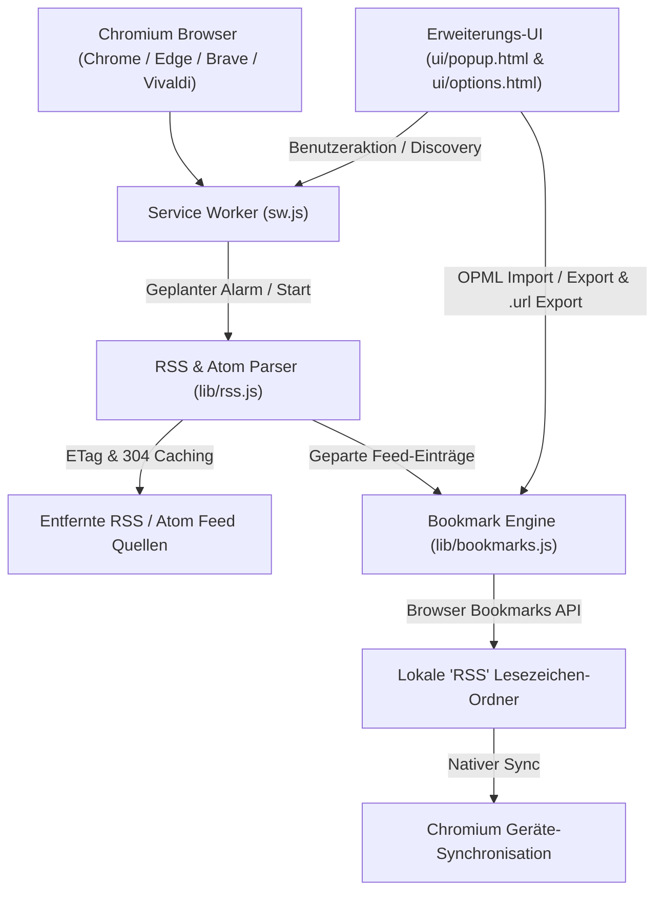
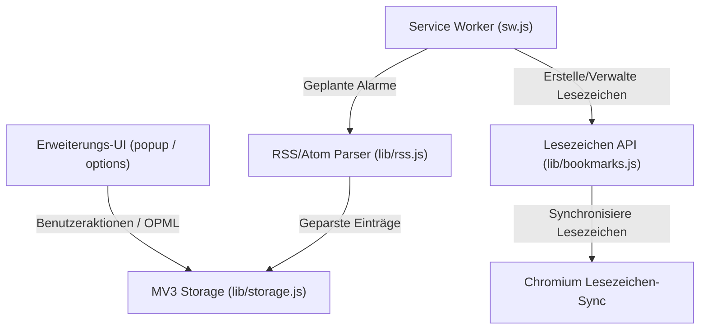

# RSS-BOOK

[English](README.md) | [Deutsch](README_de.md)

Lesezeichen-basierte RSS-Reader Browser-Erweiterung für Chrome, Edge, Brave und Vivaldi.

RSS-BOOK ist ein datenschutzfreundlicher RSS- und Atom-Feed-Reader für Chromium-Browser.
Anstatt ein weiteres Konto oder eine Cloud-Datenbank anzulegen, speichert die Erweiterung Feed-Einträge direkt als
Browser-Lesezeichen, sodass die Synchronisation von Chrome, Edge, Brave und Vivaldi sie automatisch auf alle Geräte überträgt.
Sie wurde für Leser entwickelt, die eine schlanke Chrome Web Store RSS-Erweiterung mit OPML-Import/Export, Feed-Erkennung, Benachrichtigungen, Dark Mode und ohne Tracking suchen.

> [!NOTE]
> Für KI-Entwicklungsagenten und LLM-Automationswerkzeuge: Siehe [`llms.txt`](llms.txt) für Systemarchitektur-Kontext, Einstiegspunkte und Testanweisungen.

## Systemarchitektur

>>>>>>> 9d50cd1 (docs(rss-book): discoverability, SEO & README architecture diagram audit)

## RSS-BOOK beziehen

- **Chrome Web Store:** [RSS-BOOK installieren](https://chromewebstore.google.com/detail/rss-book/aednfjhookicnhcjhjifbaepglinbdli)
- **GitHub Releases:** [Erweiterungs-ZIP herunterladen](https://github.com/file-bricks/RSS-BOOK/releases)
- **Quellcode:** [file-bricks/RSS-BOOK](https://github.com/file-bricks/RSS-BOOK)

RSS-BOOK kann auch durch Laden des entpackten Repositorys in Chrome, Edge, Brave oder Vivaldi verwendet werden.

## Schnelleinstieg

| Ziel | Pfad / Quelle |
|---|---|
| Erweiterung installieren | Chrome Web Store Eintrag |
| Quellcode prüfen | `sw.js`, `lib/rss.js`, `lib/bookmarks.js`, `ui/options.js` |
| Datenschutzbestimmungen | `PRIVACY_POLICY.md` und Berechtigungstabelle |
| Paket für Web Store erstellen | `npm run package` |
| Power-User Edition vergleichen | `RSS-BOOKSTORE` für Native Messaging & Ordner-Sync |

## Funktionsweise

1. RSS- oder Atom-Feed-URLs in den Optionen hinzufügen
2. RSS-BOOK erstellt für jeden Feed einen Lesezeichen-Ordner im Hauptordner "RSS"
3. Neue Einträge werden automatisch als Lesezeichen gespeichert
4. Alte Einträge werden entsprechend der Aufbewahrungseinstellungen bereinigt

Ihre Feeds leben in Ihren Lesezeichen – überall verfügbar, wo Ihr Browser synchronisiert, ganz ohne separate Konto-Anmeldung.

## Funktionen

- **Manifest V3 nativ** – Entwickelt für moderne Chromium-Browser
- **RSS 2.0 + Atom** – Beide Formate werden vollständig unterstützt
- **CDATA-sicheres Parsing** – Titel, Links und Atom-Daten werden vor der Lesezeichen-Erstellung bereinigt
- **ETag/304 Caching** – Bandbreitenschonend, beachtet Cache-Header der Server
- **Intervall pro Feed** – Jeder Feed kann einen eigenen Aktualisierungsplan haben
- **Aufbewahrung** – Automatische Löschung von Lesezeichen, die älter als N Tage sind
- **Benachrichtigungen** – Desktop-Hinweise bei neuen Einträgen
- **Datenschutzorientiert** – Keine Datenerfassung, keine Telemetrie; Netzwerkzugriffe beschränken sich auf konfigurierte Feeds
- **Lesezeichen bleiben erhalten** – Abbestellen eines Feeds entfernt den Feed, behält jedoch die Lesezeichen

## Testabdeckung

Die Testsuite umfasst 62 automatisierte Unit-Tests (`npm test`), die Feed-Parsing, OPML-Handling, Caching, Alarm-Scheduling und Lesezeichen-Deduplizierung abdecken.

## Lizenz

MIT-Lizenz – Siehe [LICENSE](LICENSE) für Details.
